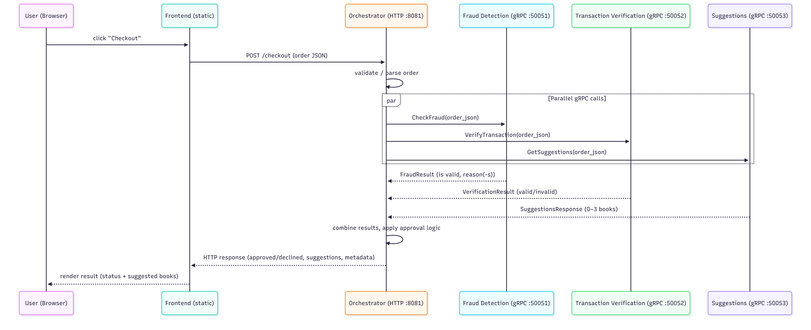
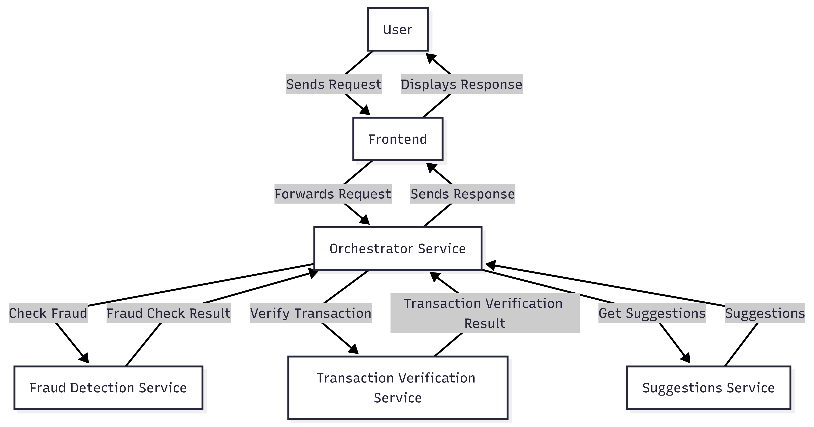

# Documentation

## REST Implementation
The REST API handles requests originating from the Frontend, ensuring communication between the user interface and backend services. The initial code is located under the `orchestrator` folder, and the API specification can be found in the `utils/api` folder. Refer to the `bookstore.yaml` file for the API specification.

## Orchestrator Service
Upon receiving a user request, the orchestrator service now coordinates an ordered multi-event workflow. It generates a unique `orderId`, initializes backend order state in all services, schedules causally dependent events, propagates vector clocks, and returns early when any intermediate event fails.

## Backend Microservices
Five backend microservices are available:

1. **Fraud Detection**
   - Listens on port `50051`.
   - Implements dummy logic to determine if an order is fraudulent.
   - Located in the `fraud_detection` folder with its own Dockerfile.

2. **Transaction Verification**
   - Listens on port `50052`.
   - Implements simple logic to verify transactions (e.g., checking if the list of items is not empty, user data is filled-in, and credit card format is correct).
   - Located in the `transaction_verification` folder with its own Dockerfile.

3. **Suggestions**
   - Listens on port `50053`.
   - Implements logic to calculate and send back a list of new book suggestions.
   - Located in the `suggestions` folder with its own Dockerfile.

4. **Order Queue**
   - Listens on port `50054`.
   - Implements `Enqueue` and `Dequeue` RPCs with in-memory FIFO order queueing.
   - Located in the `order_queue` folder with its own Dockerfile.

5. **Order Executor (replicated)**
   - Listens on port `50055` inside each executor container.
   - Replicas run the same code and coordinate with a Bully leader-election algorithm.
   - Only the current leader dequeues and executes orders (logs `Order is being executed...`).
   - Located in the `order_executor` folder with its own Dockerfile.

The `docker-compose` file at the top level of the repository lists and orchestrates these services with the necessary configurations (name, port, volumes, etc.).

## gRPC Communication Setup
Communication channels to backend microservices are established using gRPC.

- The orchestrator invokes explicit event RPCs in transaction verification, fraud detection, and suggestions, and propagates vector clocks on every event call.
- After a successful flow (`Order Approved`), orchestrator enqueues the approved order in the order queue and waits for enqueue confirmation.
- Executors coordinate among themselves via gRPC (`Ping`, `Election`, `AnnounceLeader`) and the elected leader performs dequeue/execute.

The gRPC proto file specifications are in the `utils/pb` folder.

## Event Ordering and Vector Clocks
Seminar 5 is implemented with backend-only vector clocks (components: `transaction_verification`, `fraud_detection`, `suggestions`) and explicit event ordering.

Implemented event flow:
- `validate_items` (transaction verification)
- `validate_user_data` (transaction verification)
- `validate_card_format` (transaction verification), after `validate_items`
- `prepare_suggestions_context` (suggestions), after `validate_items`
- `check_user_fraud` (fraud detection), after `validate_user_data`
- `check_card_fraud` (fraud detection), after both `validate_card_format` and `check_user_fraud`
- `generate_suggestions` (suggestions), after both `prepare_suggestions_context` and `check_card_fraud`

Concurrency is present by design (for example, `validate_items` and `validate_user_data` can run in parallel), and each event logs the current vector clock for the given `orderId`.

## Backend State Caching
Each backend service caches per-order data in memory, keyed by `orderId`. On `InitOrder`, a service stores the order payload and initializes local state including the vector clock. Event RPC handlers merge incoming clocks, increment their local component, execute dummy logic, and return the updated clock.
Cached order state is periodically pruned with TTL settings (`ORDER_STATE_TTL_SECONDS`, `ORDER_STATE_CLEANUP_INTERVAL_SECONDS`) to avoid unbounded growth.

## Failure Propagation and Cleanup
- If an event fails (business validation or fraud check), the orchestrator immediately marks the checkout as failed, cancels pending work, and returns `Order Rejected`.
- If all events succeed, the orchestrator returns `Order Approved` with suggested books.
- As the final step (success or failure), the orchestrator broadcasts `ClearOrder` with final vector clock `VCf`.
- Each backend clears local cached state only when local clock is less than or equal to `VCf`; otherwise it reports a cleanup error.

## Results Consolidation
The orchestrator combines intermediate event responses and produces a final checkout result:
- It returns "Order Rejected" immediately when a required intermediate event fails.
- Otherwise, once all required events finish successfully, it returns "Order Approved" with book suggestions.

## System Logging
Relevant logs are added in all services to track initialization, event execution, vector clock updates, event outcomes, and final cleanup decisions.

## Setup and Running the Services
1. Ensure Docker and Docker Compose are installed.
2. Build and start the services using the `docker-compose` file:
   ```sh
   docker compose up
   ```

Default startup runs two order-executor replicas (`order_executor_1`, `order_executor_2`).

To run additional replicas:
- 3 replicas total:
   ```sh
   docker compose --profile n3 up
   ```
- 4 replicas total:
   ```sh
   docker compose --profile n4 up
   ```

The Bully algorithm will elect the highest reachable executor ID as leader.

The orchestrator includes `GET /health`, and Docker Compose uses healthchecks for service startup ordering.

## Architecture Diagram



## System Diagram


